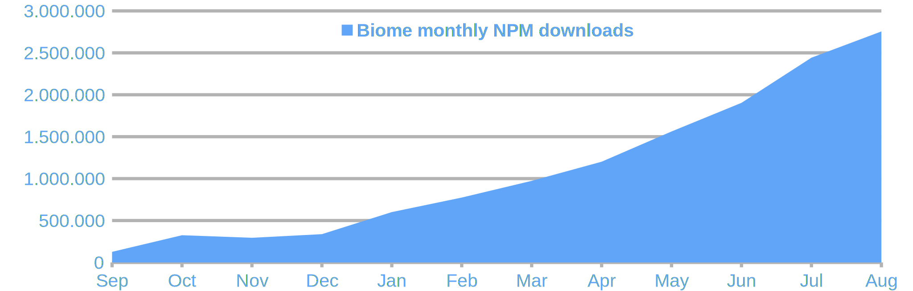

Today we’re excited to announce the release of Biome v1.9 and to celebrate the first anniversary of Biome 🎊

Let's take a look back at the first year of Biome and then explore the new features in Biome 1.9.


## One year of Biome

We officially [announced Biome](/blog/annoucing-biome/) on 29 August 2023.
From its inception, Biome has been a community-driven project.
We have a governance and a solid base of contributors.

In October 2023, one of the creators of Prettier launched [the Prettier challenge](https://console.algora.io/challenges/prettier) that rewarded any project written in Rust that passes at least 95% of the Prettier tests for JavaScript.
We quickly organized ourselves to get there as soon as possible.
By the end of November, we [surpassed this goal](/blog/biome-wins-prettier-challenge/) by passing 97% of the Prettier tests for JavaScript, as well as TypeScript, JSX and TSX!
In the process, we identified several formatting issues in Prettier.
This has also pushed contributions to Prettier to greatly improve its performance.
This challenge was a win for the whole web ecosystem!

Winning the challenge brought Biome to light.
People have shown a lot of interest and Biome has been quickly adopted by many projects, including big ones such as [Ant Design](https://ant.design/), [Astro](https://astro.build/), [Sentry](https://sentry.io/), [daisyUI](https://daisyui.com/), [Refine](https://refine.dev/), [Discord](https://discord.com/), [Pulumi](https://www.pulumi.com/), [Label Studio](https://labelstud.io/), [Spicetify](https://spicetify.app/), [Apify](https://apify.com/), [Slint](https://slint.dev/), [Rspack](https://rspack.dev/), [FluidFramework](https://fluidframework.com/), [and others](https://sourcegraph.com/search?q=file:biome.json&patternType=literal&sm=0).

We surpassed 2.7 million monthly NPM downloads in August 2024.



We also gained sponsorship, notably [Shiguredo](https://shiguredo.jp/), [l2BEAT](https://l2beat.com/), [Phoenix Labs](https://www.phoenixlabs.dev/), [KANAME](https://kanamekey.com/), [Nanabit](https://nanabit.dev/), [Vital](https://vital.io/), [CodeRabbit](https://coderabbit.ai/), and [Forge42](https://forge42.dev/).
These sponsorships are vital to the project.

We also gained many new contributors.
We started with a team of 5 core contributors, and we are now a team of 8 core contributors and 10 maintainers.

In June 2024, Biome won the [JSNation's productivity booster Open Source Award](https://x.com/thejsnation/status/1805561129915060248).


## Biome v1.9

As we celebrate Biome's first year, we're pleased to announce the release of Biome 1.9, which brings many new features and bug fixes.

### Stable CSS formatter and linter

We are thrilled to announce that Biome's CSS formatter and linter are now considered stable and are enabled by default.
Do note that Biome only parses **standard CSS syntax** so far, and doesn't yet handle CSS dialects such as SCSS. Since this is brand new functionality, you may also still run into some rough edges. Please report any problems you encounter!

The CSS linter provides 15 stable lint rules that were ported from [stylelint](https://stylelint.io/):

- [a11y/useGenericFontNames](https://biomejs.dev/linter/rules/use-generic-font-names/)
- [correctness/noInvalidDirectionInLinearGradient](https://biomejs.dev/linter/rules/no-invalid-direction-in-linear-gradient/)
- [correctness/noInvalidGridAreas](https://biomejs.dev/linter/rules/no-invalid-grid-areas/)
- [correctness/noInvalidPositionAtImportRule](https://biomejs.dev/linter/rules/no-invalid-position-at-import-rule/)
- [correctness/noUnknownFunction](https://biomejs.dev/linter/rules/no-unknown-function/)
- [correctness/noUnknownMediaFeatureName](https://biomejs.dev/linter/rules/no-unknown-media-feature-name/)
- [correctness/noUnknownProperty](https://biomejs.dev/linter/rules/no-unknown-property/)
- [correctness/noUnknownUnit](https://biomejs.dev/linter/rules/no-unknown-unit/)
- [correctness/noUnmatchableAnbSelector](https://biomejs.dev/linter/rules/no-unmatchable-anb-selector/)
- [suspicious/noDuplicateAtImportRules](https://biomejs.dev/linter/rules/no-duplicate-at-import-rules/)
- [suspicious/noDuplicateFontNames](https://biomejs.dev/linter/rules/no-duplicate-font-names/)
- [suspicious/noDuplicateSelectorsKeyframeBlock](https://biomejs.dev/linter/rules/no-duplicate-selectors-keyframe-block/)
- [suspicious/noEmptyBlock](https://biomejs.dev/linter/rules/no-empty-block/)
- [suspicious/noImportantInKeyframe](https://biomejs.dev/linter/rules/no-important-in-keyframe/)
- [suspicious/noShorthandPropertyOverrides](https://biomejs.dev/linter/rules/no-shorthand-property-overrides/)

If you don't want Biome to format and lint your CSS files,
you can disable the CSS formatter and linter in the Biome configuration file:

```json
{
  "css": {
    "formatter": {
      "enabled": false
    },
    "linter": {
      "enabled": false
    }
  }
}
```

or on the command line:

```shell
biome format --css-formatter-enabled=false
biome lint --css-linter-enabled=false
biome check --css-formatter-enabled=false --css-linter-enabled=false
```

Special thanks to [Denis Bezrukov @denbezrukov](https://github.com/denbezrukov) and [Jon Egeland @faultyserver](https://github.com/faultyserver) for implementing most of the CSS parser and formatter!
Special thanks to [Yoshiaki Togami @togami2864](https://github.com/togami2864) for coordinating the implementation and for implementing most of the CSS lint rules!

### Stable GraphQL formatter and linter

Another brand new feature: Biome now formats and lints GraphQL files by default.

For now, Biome provides two nursery rules:

- [nursery/noDuplicateFields](https://biomejs.dev/linter/rules/no-duplicate-fields/)
- [nursery/useDeprecatedReason](https://biomejs.dev/linter/rules/use-deprecated-reason/)

If you don't want Biome to format and lint your GraphQL files,
you can disable the GraphQL formatter and linter in the Biome configuration file:

```json
{
  "graphql": {
    "formatter": {
      "enabled": false
    },
    "linter": {
      "enabled": false
    }
  }
}
```

or on the command line:

```shell
biome format --graphql-formatter-enabled=false
biome lint --graphql-linter-enabled=false
biome check --graphql-formatter-enabled=false --css-linter-enabled=false
```

Special thanks to [Võ Hoàng Long @vohoanglong0107](https://github.com/vohoanglong0107) for implementing most of the features related to GraphQL.

### Search command

Back in February, one of our Core Contributors published [a proposal for plugin support](https://github.com/biomejs/biome/discussions/1762). One of the highlights was the use of GritQL as a foundation for our plugin system.

[GritQL](https://docs.grit.io/language/overview) is a powerful query language that lets you do structural searches on your codebase. This means that trivia such as whitespace or even the type of string quotes used will be ignored in your search query. It also has many features for querying the structure of your code, making it much more elegant for searching code than regular expressions.

Integrating a query language such as GritQL is no easy feat, and throughout the year we published [multiple](https://github.com/biomejs/biome/discussions/2286) [status](https://github.com/biomejs/biome/discussions/2585) [updates](https://github.com/biomejs/biome/discussions/3392). Today, we release the first product of this effort: A new `biome search` command.

While we believe this command may already be useful to users in some situations (especially when it gets integrated in our IDE extensions!), this command is really a stepping stone towards our plugin efforts. By allowing our users to try it out in a first iteration, we hope to gain insight into the type of queries you want to do, as well as the bugs we need to focus on.

For now, the search command is explicitly marked as **EXPERIMENTAL**, since many limitations are yet to be fixed or explored. Keep this in mind when you try it out, and please let us know what you think!

Even though there are still plenty of limitations, we do believe the integration has progressed far enough that we can shift our focus towards the integration of actual plugins. We cannot yet promise a timeline, but we'll keep you posted!

PS.: GritQL escapes code snippets using backticks, but most shells interpret backticks as command invocations. To avoid this, it's best to put single quotes around your Grit queries.
For instance, the following command search for all `console.log` invocations:

```shell
biome search '`console.log($message)`'
```

Special thanks to [Grit](https://grit.io) for open-sourcing GritQL, [Arend van Beelen @arendjr](https://github.com/arendjr) for integrating the GritQL engine into Biome, and to [@BackupMiles] for implementing the formatting of search results in the `biome search` command!

### `.editorconfig` support

Biome is now able to take the [`.editorconfig`](https://editorconfig.org/) of your project into account.
This is an opt-in feature. You have to turn it on in your Biome configuration file:

```json title="biome.json"
{
  "formatter": {
    "useEditorconfig": true
  }
}
```

Note that all options specified in the Biome configuration file override the ones specified in `.editorconfig`.
For now, only the `.editorconfig` at the root of your project is taken into account.

Special thanks to [Carson McManus @dyc3](https://github.com/dyc3) for implementing this feature!

### JavaScript formatter and linter

We updated the JavaScript formatter to match [Prettier v3.3](https://github.com/prettier/prettier/blob/main/CHANGELOG.md#333).
The most significant change is adding parentheses around nullish coalescing in ternaries.
This change adds clarity to operator precedence.

```json
// Input
foo ? bar ?? foo : baz;

// Biome 1.8.3 and Prettier 3.3.2
foo ? bar ?? foo : baz;

// Biome 1.9 and Prettier 3.3.3
foo ? (bar ?? foo) : baz;
```

Regarding the linter, we stabilized the following lint rules:

- [a11y/noLabelWithoutControl](https://biomejs.dev/linter/rules/no-label-without-control/)
- [a11y/useFocusableInteractive](https://biomejs.dev/linter/rules/use-focusable-interactive/)
- [accessibility/useSemanticElements](https://biomejs.dev/linter/rules/use-semantic-elements/)
- [complexity/noUselessStringConcat](https://biomejs.dev/linter/rules/no-useless-string-concat/)
- [complexity/noUselessUndefinedInitialization](https://biomejs.dev/linter/rules/no-useless-undefined-initialization/)
- [complexity/useDateNow](https://biomejs.dev/linter/rules/use-date-now/)
- [correctness/noUndeclaredDependencies](https://biomejs.dev/linter/rules/no-undeclared-dependencies/)
- [correctness/noInvalidBuiltinInstantiation](https://biomejs.dev/linter/rules/no-invalid-builtin-instantiation/)
- [correctness/noUnusedFunctionParameters](https://biomejs.dev/linter/rules/no-unused-function-parameters/)
- [correctness/useImportExtensions](https://biomejs.dev/linter/rules/use-import-extensions/)
- [performance/useTopLevelRegex](https://biomejs.dev/linter/rules/use-top-level-regex/)
- [style/noDoneCallback](https://biomejs.dev/linter/rules/no-done-callback/)
- [style/noYodaExpression](https://biomejs.dev/linter/rules/no-yoda-expression/)
- [style/useConsistentBuiltinInstantiation](https://biomejs.dev/linter/rules/use-consistent-builtin-instantiation/)
- [style/useDefaultSwitchClause](https://biomejs.dev/linter/rules/use-default-switch-clause/)
- [style/useExplicitLengthCheck](https://biomejs.dev/linter/rules/use-explicit-length-check/)
- [style/useThrowNewError](https://biomejs.dev/linter/rules/use-throw-new-error/)
- [style/useThrowOnlyError](https://biomejs.dev/linter/rules/use-throw-only-error/)
- [suspicious/noConsole](https://biomejs.dev/linter/rules/no-console/)
- [suspicious/noEvolvingTypes](https://biomejs.dev/linter/rules/no-evolving-types/)
- [suspicious/noMisplacedAssertion](https://biomejs.dev/linter/rules/no-misplaced-assertion/)
- [suspicious/noReactSpecificProps](https://biomejs.dev/linter/rules/no-react-specific-props/)
- [suspicious/useErrorMessage](https://biomejs.dev/linter/rules/use-error-message/)
- [suspicious/useNumberToFixedDigitsArgument](https://biomejs.dev/linter/rules/use-number-to-fixed-digits-argument/)

And we added the following new rules:

- [nursery/noRestrictedTypes](https://biomejs.dev/linter/no-restricted-types/)
- [nursery/noDynamicNamespaceImportAccess](https://biomejs.dev/linter/no-dynamic-namespace-import-access/)
- [nursery/noIrregularWhitespace](https://biomejs.dev/linter/rules/no-irregular-whitespace)
- [nursery/useTrimStartEnd](https://biomejs.dev/linter/rules/use-trim-start-end/)
- [nursery/noUselessEscapeInRegex](https://biomejs.dev/linter/rules/no-useless-escape-in-regex/)
- [nursery/useConsistentMemberAccessibility](https://biomejs.dev/linter/rules/use-consistent-member-accessibility/)

### And more!

For the full list of changes, please refer to our [changelog](/internals/changelog/).

## What's next

### VSCode plugin v3

### Biome 2.0
